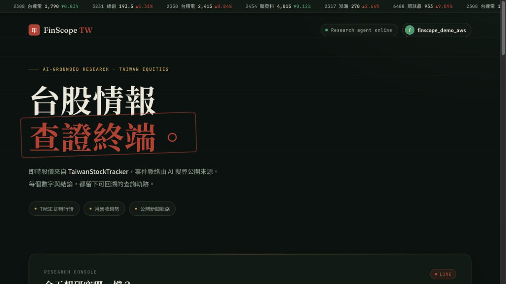
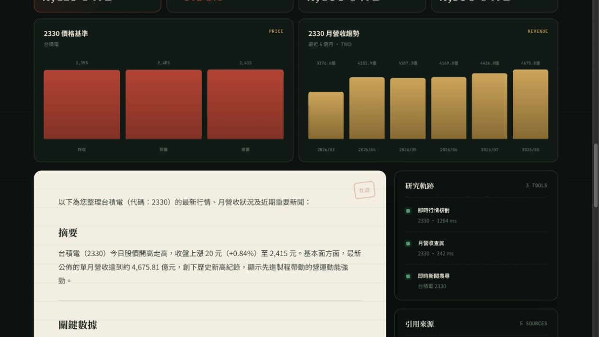

# FinScope TW — Taiwan Stock Research Agent

A grounded Taiwan-stock research assistant that decides when to retrieve live
market data, revenue history, and current web sources before answering. It is a
research tool—not a price predictor or trading-signal generator.

The companion Java MCP Server lives in
[Yneq/StockTracker](https://github.com/Yneq/StockTracker).

For a complete architecture walkthrough, code map, testing strategy, and demo
script, see the [Traditional Chinese interview guide](docs/INTERVIEW_GUIDE.md).

## Live demo

[Open FinScope TW](https://vanceai.space/) and choose **One-click demo** to try
the authenticated research workflow without creating an account.

[Open the visual code walkthrough](https://yneq.github.io/taiwan-stock-research-agent/)
to understand the real architecture, request flow, security boundaries, failure
handling, and current test evidence without reading the repository line by line.



The dashboard combines a live TWSE ticker, grouped research prompts, member
authentication, and an observable agent workflow in a Taiwan-market visual
language.



A completed brief keeps the model answer beside deterministic market charts,
the tools that were called, their latency, and the public sources used. This
makes retrieval failures and unsupported claims visible instead of hiding them
behind the final prose.

## What it demonstrates

- Deterministic research planning with parallel data retrieval
- A single Gemini synthesis call after evidence collection
- Free, keyless current-news search with structured citations
- Python MCP Client calling a separate Java/Spring Boot MCP Server
- Java-owned member accounts bridged through a FastAPI BFF with HttpOnly JWT cookies
- Observable tool traces, failure handling, rate limiting, tests, and eval cases
- Cost-aware deployment where the hosted model stays outside the app container

## Architecture

```text
Browser
   │ same-origin UI + HttpOnly session cookie
   ▼
FastAPI research service ── verified JSON ─► Gemini Interactions API (once)
   │
   ├── member BFF + Bearer JWT ────────────► TaiwanStockTracker auth/watchlist APIs
   ├── parallel current-news search ───────► Google News RSS
   │
   └── parallel MCP + X-Agent-Key ─────────► TaiwanStockTracker (Spring Boot)
                                      ├─ TWSE MIS
                                      ├─ FinMind
                                      └─ Neon PostgreSQL
```

Gemini never receives database credentials or tool access. The Python service
plans and executes approved read-only queries first, then sends only their JSON
results to Gemini for one final synthesis call.

TaiwanStockTracker remains the source of truth for users, passwords, JWTs, and
watchlists. The browser never stores or reads the JWT: FastAPI keeps it in a
same-origin `HttpOnly`, `SameSite=Lax` cookie and validates it before research.

## Agent workflow

1. FastAPI classifies the user's Taiwan-stock research question.
2. It plans zero or more approved read-only queries:
   - `get_stock_snapshot`
   - `get_revenue_history`
   - `search_news`
3. FastAPI runs independent news and Java MCP queries in parallel.
4. Their verified JSON results go to Gemini in one synthesis request with no tools enabled.
5. Gemini produces a Traditional Chinese brief with explicit limitations.
6. The UI displays the answer, tool trace, citations, and per-stage latency.

Pure quote requests bypass Gemini entirely. Full research uses one Gemini call;
invalid responses, timeouts, unknown stock codes, and upstream failures fail
closed instead of inventing data.

## Project structure

```text
app/
├── agent/          # deterministic planner, parallel retrieval, and research policy
├── api/            # FastAPI endpoints
├── clients/        # Gemini gateway and StockTracker MCP Client
├── middleware/     # portfolio-demo request limiter
├── schemas/        # validated API contracts
├── static/         # responsive research interface
└── tools/          # function declarations and execution
evals/cases.json    # fixed behavioral evaluation set
tests/              # orchestration, configuration, and HTTP adapter tests
```

## Requirements

- Python 3.12
- A running TaiwanStockTracker service with its `/mcp` endpoint enabled
- A Gemini API key and a model configured through `GEMINI_MODEL`

## Local setup

```bash
python3.12 -m venv .venv
source .venv/bin/activate
pip install -e '.[dev]'
cp .env.example .env
```

Set the environment variables in your shell or load them with your preferred
local environment manager:

```text
GEMINI_API_KEY=...
GEMINI_MODEL=gemini-3.5-flash-lite
STOCKTRACKER_BASE_URL=http://localhost:8080
STOCKTRACKER_API_KEY=...
JWT_SECRET=the-same-secret-used-by-the-java-service
SESSION_COOKIE_NAME=finscope_session
SESSION_COOKIE_SECURE=false
DEMO_USERNAME=finscope_demo
DEMO_EMAIL=demo@finscope.tw
DEMO_PASSWORD=a-server-side-secret
MAX_AGENT_STEPS=3
REQUEST_TIMEOUT_SECONDS=150
```

The application automatically loads a local `.env` file through
`python-dotenv`. The file is excluded from Git.

`STOCKTRACKER_API_KEY` must match `AGENT_API_KEY` on the Java service.
`JWT_SECRET` must also match the Java service so Python can validate its signed
member tokens. Set `SESSION_COOKIE_SECURE=true` in HTTPS deployments.

Run the app:

```bash
uvicorn app.main:app --reload
```

Open `http://localhost:8000` or view the API contract at
`http://localhost:8000/docs`.

## API

### `POST /api/research`

Requires a valid member session cookie. If the visitor starts research while
logged out, the UI opens the member dialog and automatically resumes the queued
question after login or registration.

```json
{
  "question": "台積電今天股價如何？近期有哪些重要事件？"
}
```

The response includes:

- the final research answer;
- every custom tool trace;
- structured source URLs returned by the news search tool;
- the active model ID and financial-information disclaimer.

### Member BFF endpoints

| Method | Path | Purpose |
|---|---|---|
| POST | `/api/session/login` | Exchange StockTracker credentials for an HttpOnly session |
| POST | `/api/session/register` | Create a Java-owned account and sign in |
| POST | `/api/session/demo` | One-click portfolio login using server-only credentials |
| GET | `/api/session/me` | Return the safe member profile |
| POST | `/api/session/logout` | Clear the browser session |
| GET | `/api/member/watchlist` | Return the logged-in member's Java watchlist |

### `GET /health`

Used by Render to wake and monitor the service.

## Verification

```bash
pytest
python -m compileall -q app
node --check app/static/app.js
```

The initial evaluation set in `evals/cases.json` covers quote lookup, company-name
resolution, OTC stocks, revenue, current news, citations, invalid codes,
weekends, upstream timeouts, direct investment advice, prediction requests,
causality overclaims, unrelated questions, and prompt injection.

With both services running, execute the deterministic tool-use checks:

```bash
python evals/run_evals.py --base-url http://localhost:8000
```

To verify the MCP connection without invoking Gemini, start the Java service
and run:

```bash
.venv/bin/python scripts/check_mcp.py --stock-code 2330
```

The command discovers the tools registered by the Java MCP Server and calls
`get_stock_snapshot` through MCP using the shared service key.

The runner scores required query planning, important tool arguments, unnecessary
queries, and citation presence. Qualitative answer claims remain a manual
review item for the MVP.

## Deployment

The included `Dockerfile` and `render.yaml` deploy one lightweight FastAPI web
service to Render. Configure all secrets in Render—not in GitHub.

The Java MCP Server is deployed separately. Its public URL becomes
`STOCKTRACKER_BASE_URL`; the Python service connects to its `/mcp` endpoint.
The shared random service key is configured as `AGENT_API_KEY` on Java and
`STOCKTRACKER_API_KEY` on Python.

For the always-on portfolio deployment, the
[AWS Lightsail bundle](deploy/aws/README.md) runs Caddy, this FastAPI service,
and the Java MCP Server as separate containers on one instance. Java remains on
an internal Docker network, removing the free-tier cross-service cold start.

Configure the same `JWT_SECRET` on both Render services. On Python, also set
`SESSION_COOKIE_SECURE=true`; the included Blueprint already declares this
non-secret production setting.

Set `DEMO_USERNAME`, `DEMO_EMAIL`, and a strong `DEMO_PASSWORD` only on the
Python service. The first one-click demo request creates that Java-owned member
if necessary; the password is never shipped to browser JavaScript.

The production timeout is 150 seconds so a first request can wait for the free
Java service to wake from inactivity. Warm requests normally complete much
faster.

The model runs on Google's infrastructure, so no model weights or GPU runtime
are stored in the Render container.

## Responsible-use boundary

FinScope TW summarizes public information and identifies possible context. It
does not predict prices, guarantee causal explanations, personalize investment
recommendations, or execute trades. Users should verify primary sources before
making financial decisions.
