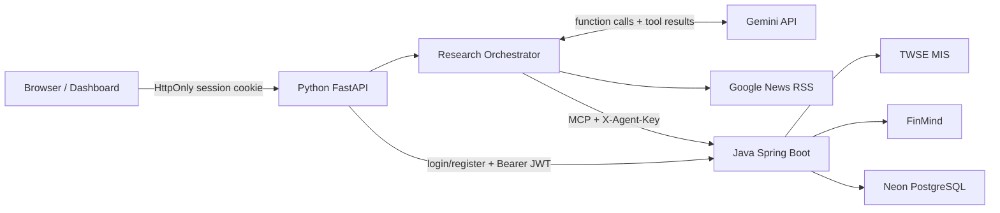
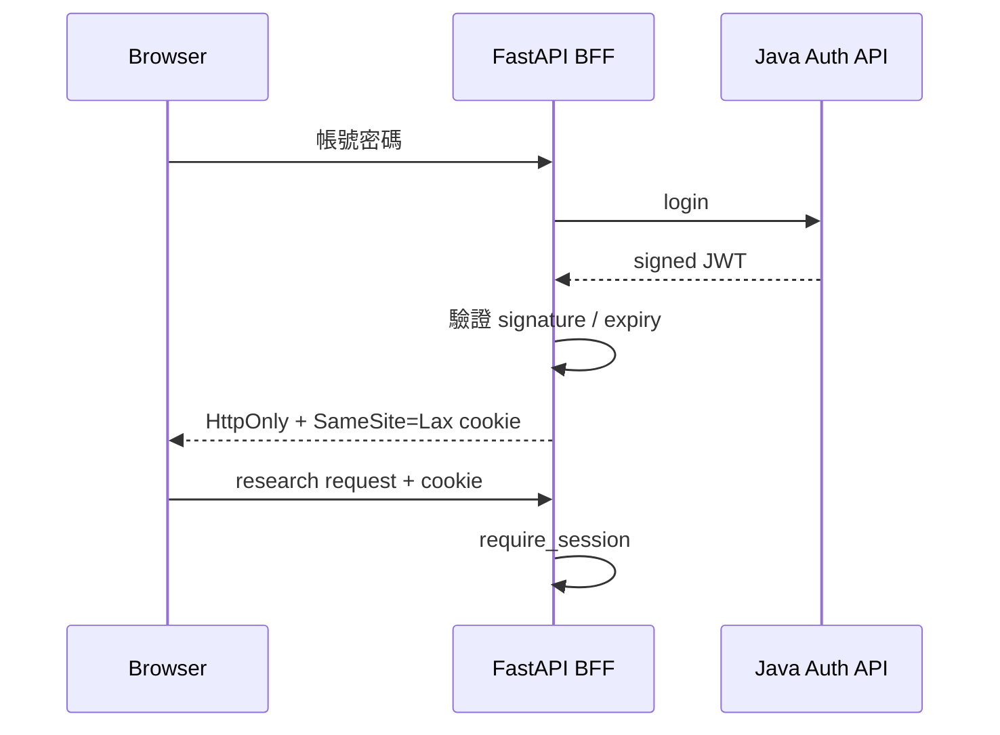

# FinScope TW 面試技術說明

這份文件用來說明 `taiwan-stock-research-agent` 與 `StockTracker` 如何共同組成一個可查證的台股研究 Agent，以及面試時應如何介紹架構、程式碼與工程取捨。

## 30 秒專案介紹

FinScope TW 是一個「會自己選工具查資料」的台股研究助理。使用者用自然語言提問後，Python Agent 會透過 Gemini function calling 判斷是否需要查即時行情、月營收或近期新聞；其中股票資料不是由模型猜測，而是透過 MCP 呼叫獨立的 Java/Spring Boot StockTracker。系統最後整合資料、列出工具軌跡與新聞來源，但不預測股價，也不提供買賣建議。

一句話版本：

> 我把原有的 Java 台股資料系統擴充成 MCP Server，再用 Python 建立具備工具選擇、引用來源、會員驗證與錯誤處理的研究 Agent。

## 為什麼值得做成兩個服務

| 服務 | 主要責任 | 為什麼由它負責 |
|---|---|---|
| Java / StockTracker | 股票資料、會員、JWT、PostgreSQL、MCP tools | 延續原有 Java domain service，維持單一資料來源 |
| Python / Research Agent | LLM orchestration、新聞搜尋、工具迴圈、BFF、研究介面 | Python 的 AI SDK 與測試工具成熟，適合快速迭代 Agent |
| Gemini | 判斷需要哪些工具、綜合已取得的內容 | 只負責推理，不直接持有 DB 或服務密鑰 |

拆成兩個 repository 不是 MCP 的必要條件，但能清楚呈現服務邊界：Java 是可被不同 AI Client 重複使用的資料工具服務，Python 是目前的一個 Agent Client。未來換模型或新增另一個 Agent，不必改寫股票商業邏輯。

## 系統架構



### 一次研究請求如何流動

1. 使用者登入後送出自然語言問題。
2. FastAPI 驗證 HttpOnly cookie，將問題交給 `ResearchOrchestrator`。
3. Gemini 回傳 function call，而不是直接編造需要查證的數字。
4. Python 執行新聞工具，或透過 MCP 呼叫 Java 的行情與營收工具。
5. 工具 JSON 結果送回同一輪 Gemini interaction；資訊不足時可再選工具。
6. 最多三輪後產生繁體中文研究摘要，前端同步顯示工具軌跡、耗時與引用來源。
7. 工具失敗時保留明確的資料限制，不用模型猜一個數字補上。

## Java：原專案增加了什麼

Java 仍然是股票與會員資料的 source of truth。AI 擴充集中在以下區域：

| 程式位置 | 面試時的說法 |
|---|---|
| `com.service.agent.AgentStockService` | 將 TWSE、FinMind 原始回應轉成穩定的 domain DTO，驗證四碼股票代號並統一例外 |
| `com.controller.AgentStockController` | 提供一般 REST 版本的行情與營收端點，方便除錯及非 MCP Client 使用 |
| `com.mcp.StockMcpTools` | 用 Spring AI `@Tool` 暴露 `get_stock_snapshot`、`get_revenue_history` |
| `com.config.McpToolConfig` | 將 Java 方法註冊成 MCP tools |
| `com.config.AgentApiKeyInterceptor` | 以 `X-Agent-Key` 保護 Agent/MCP 端點，並使用 constant-time comparison |
| `com.exception.api` | 將無效代號、查無股票、上游失敗轉成一致且可理解的錯誤 |
| `com.util.HttpUtil` | 對暫時性的上游錯誤加入有限次 retry，不對所有錯誤無限重試 |
| `com.controller.HealthController` | 提供部署平台與 Python warm-up 使用的健康檢查 |

會員功能不是在 Python 重新做一套。Java 繼續負責 bcrypt 密碼雜湊、使用者資料與 JWT 簽發；Python 只扮演 BFF。

近期針對正式環境也強化了：

- `DBUtil` 驗證資料庫環境變數，讓設定錯誤能提早被發現。
- `UserDaoImpl` 使用 try-with-resources 並向上拋出 DB 錯誤，不再把寫入失敗誤報成註冊成功。
- `AuthController` 能區分帳密錯誤與會員資料庫不可用，後者回傳 503。
- `AuthServiceImpl` 改為建構式注入 `UserDao`，讓密碼雜湊、重複帳號與 DB 失敗可被獨立測試。

### Java MCP tool 的價值

MCP tool 回傳的是有結構的 `StockSnapshotToolResult` 與 `RevenueHistoryToolResult`，而不是拼成一段自然語言。這讓模型收到明確欄位，也讓同一個 Java tool 可以被其他 MCP Client 重用。

## Python：Agent 服務如何組成

| 程式位置 | 責任 |
|---|---|
| `app/main.py` | FastAPI lifecycle、依賴組裝、health/warm-up、market ticker cache |
| `app/agent/orchestrator.py` | system policy、最多三輪的 function-calling loop、工具去重、fail-closed |
| `app/tools/definitions.py` | 宣告 Gemini 可選擇的三個工具與參數 schema |
| `app/tools/executor.py` | 執行工具、統一成功/失敗格式並記錄耗時 |
| `app/clients/stocktracker.py` | 可重用的 MCP session、Java readiness、API key、結果解碼與錯誤正規化 |
| `app/clients/news.py` | 搜尋 Google News RSS，解析標題、時間與來源連結 |
| `app/clients/gemini.py` | 將 Gemini interaction/function call 轉成應用程式內部介面 |
| `app/clients/auth.py` | 呼叫 Java 註冊、登入與會員 API |
| `app/auth/session.py` | 驗證 Java HS256 JWT，轉成安全的同源 HttpOnly cookie session |
| `app/api/session.py` | 登入、登出、demo account 與會員資料端點 |
| `app/api/research.py` | 驗證會員後接受研究請求 |
| `app/middleware/rate_limit.py` | 控制作品集公開服務的請求頻率與模型成本 |
| `app/static` | Dashboard、快速提問、圖表、研究軌跡與引用來源 UI |

### Agent 不等於單次 prompt

這個專案的核心不是「把問題丟給 Gemini」：

- 模型只看到工具定義，實際 API key 與資料庫密碼不會交給模型。
- 模型決定要查哪個工具，但程式碼掌握允許執行的工具清單與參數驗證。
- 每次工具結果會回到 interaction，模型可依結果決定下一步。
- 迴圈最多三輪，避免成本失控或 Agent 無限循環。
- 即時股價必須來自 snapshot tool；近期事件必須有 news source。
- 失敗會明示資料限制，不把模型既有知識偽裝成即時查詢結果。

## 會員與安全邊界



重要設計點：

- 瀏覽器 JavaScript 讀不到 JWT，降低 token 被前端腳本竊取的風險。
- Java 與 Python 必須使用同一組 `JWT_SECRET`；不同用途的 `AGENT_API_KEY` 保護 MCP 服務。
- Demo 密碼只存在 Render server environment，API response 與前端程式都不回傳它。
- Demo 第一次使用時，Python 先嘗試登入；只有收到 401 才註冊並重試。已有帳號時不會重複註冊。
- 公開作品集加上 rate limit；MCP tools 是唯讀工具，沒有下單能力。

## Unit test：推薦，而且要測對地方

推薦做單元測試，但不要測「Gemini 每次是否寫出完全相同的句子」。LLM 輸出具有非決定性，應把測試分成三層：

| 層次 | 測什麼 | 本專案做法 |
|---|---|---|
| Unit / component tests | 可決定的程式邏輯與錯誤分支 | Java Maven tests、Python pytest |
| Behavioral evals | Agent 是否選到必要工具、是否附限制與引用 | `evals/cases.json`、`evals/run_evals.py` |
| Live smoke test | 真實部署、MCP handshake、TWSE/FinMind 是否可連 | `scripts/check_mcp.py` 與網站 demo |

目前測試結果：

- Java：23 tests，0 failures，0 errors。
- Python：24 tests，全部通過。

這次新增的高價值案例：

- Java 註冊前會雜湊密碼，DAO 收到的不是明文。
- Java DB 寫入失敗必須向上拋出，不能顯示假成功。
- Java 重複 username 不得執行 insert。
- Python demo 首次登入遇到 401，會註冊後重試。
- Python demo 帳號已存在時，不會再次註冊。
- JWT cookie 不會把 token 或 demo 密碼放進 response body。

執行方式：

```bash
# Java
mvn test

# Python
.venv/bin/python -m pytest -q
```

## 真實問題與修正：面試很好用的案例

### 1. Render cold start 導致 MCP timeout

**問題：** Python 已醒來，但免費 Render 上的 Java 仍在休眠；第一個 MCP request 在 Java ready 前逾時。

**處理：** 加入 Java health readiness、Python 背景 warm-up、瀏覽器進站預熱、延長有上限的等待時間，並重用已建立的 MCP session。

**學到：** 問題不是「LLM 不穩」，而是跨服務 lifecycle 與免費部署資源限制。觀測工具軌跡後才能找到真正故障點。

### 2. 註冊顯示成功，但 Neon 沒有資料

**問題：** Render 的 DB URL 格式曾設定錯誤，修正後又遇到 `created_at NOT NULL`；舊 DAO 捕捉 SQLException 後只印 log，Service 因此誤以為成功。

**處理：** 修正環境設定及 insert SQL，DAO 改為 try-with-resources、驗證 affected rows 並傳遞錯誤；Controller 將基礎設施故障回成 503。

**學到：** 不應在 data access layer 吞掉錯誤。API 的狀態碼也是系統契約，401 與 503 對除錯和使用者體驗有完全不同的意義。

### 3. TWSE 偶發失敗

**問題：** 即使服務已啟動，上游行情 API 仍可能短暫失敗。

**處理：** Java HTTP client 對可恢復的暫時性錯誤做有限 retry，並將最後失敗轉成結構化 tool error；Agent 明示資料限制。

**學到：** retry 必須有範圍與上限，且不能把永久性錯誤或無效股票代號當成暫時性錯誤重試。

## 面試常見問題與建議回答

### 為什麼不用 Java 直接呼叫 Gemini？

Java 保留已成熟的股票、會員與資料庫能力；Python 專注 Agent orchestration。這不是因為 Java 做不到 AI，而是讓模型或 orchestration 的變更不影響既有 domain service，也能展示跨語言服務整合。

### MCP 和一般 REST API 差在哪裡？

REST 端點是為固定的應用流程設計；MCP 讓 AI Client 用標準方式發現 tool 名稱、輸入 schema 與結構化結果。底層仍是 HTTP，但 Agent 不需要為每個 Java 方法寫一套專屬協定。專案同時保留 REST，方便一般 Client 與診斷。

### 怎麼降低 hallucination？

我沒有宣稱完全消除 hallucination，而是建立約束：需要即時數字時強制使用工具、工具結果用 JSON、近期事件要有來源、限制迴圈、工具失敗就明示缺資料，並在 UI 顯示查詢軌跡。

### 為什麼不用本地模型？

本專案的重點是穩定的 function calling。模型透過環境設定可替換，目前選擇 hosted Gemini 來降低 demo 的工具選擇失敗率，也避免在免費 web service 裡承擔模型記憶體與啟動成本。

### 怎麼控制成本？

限制最多三輪工具迴圈、限制新聞筆數與查詢期間、公開 API rate limit、market ticker cache，並把模型部署交給 API provider。這些限制同時控制成本、latency 與失控風險。

### 如果 Java 或外部 API 壞掉呢？

Tool executor 會保留 error trace；可恢復的連線問題有限重試，仍失敗時回覆資料限制。Agent 不會用新聞中的數字冒充 MCP 即時行情。

### 為什麼要同時有 unit tests 和 evals？

Unit test 適合 JWT、錯誤轉換、DAO interaction、tool dispatch 等決定性邏輯；eval 適合檢查「遇到某類問題是否選對工具、是否遵守回答政策」。兩者處理不同風險，不能互相取代。

## 三分鐘 Demo 腳本

1. **20 秒：定位** —「這不是選股或交易機器人，而是每個即時數字都有工具軌跡的台股研究助理。」
2. **30 秒：會員** — 點一鍵 Demo 登入，說明 Java 管理帳號/JWT，Python 以 HttpOnly cookie 保護瀏覽器 session。
3. **50 秒：行情** — 問「台積電今天股價和漲跌幅」，指出 Gemini 選了 Java MCP snapshot tool，畫面顯示耗時與結果。
4. **50 秒：複合問題** — 問「聯發科近期 AI 晶片消息與營收趨勢」，展示新聞、營收工具與引用來源。
5. **30 秒：架構** — 說明 Python Agent 與 Java domain service 的分工，以及 MCP/X-Agent-Key 邊界。
6. **30 秒：可靠性** — 展示測試結果與 tool failure 的資料限制，強調不編造即時數據。

## 不要過度宣稱

- 不說「能預測股票漲跌」或「可以推薦買賣」。
- 不說「完全不會 hallucinate」；應說有 grounding、policy 與 failure handling 降低風險。
- 不把 Google News RSS 當成完整的專業市場資料庫。
- 不宣稱目前具備 production-grade 高可用；Render free tier 的 cold start 是已知限制。
- 不因為用了 MCP 就說它是多 Agent 系統；目前是一個 Agent orchestration service 加兩類外部工具。

## 下一步可擴充

1. 增加固定測試題庫與自動化 LLM-as-judge / rule-based eval report。
2. 將 tool trace、latency、error rate 接到可觀測性平台。
3. 為同一問題加入來源時間與資料新鮮度檢查。
4. 加入研究紀錄保存與會員自選股情境，但維持 tools 唯讀。
5. 若流量提高，再把服務搬到不休眠的主機並設定正式的 secret manager、監控與告警。
