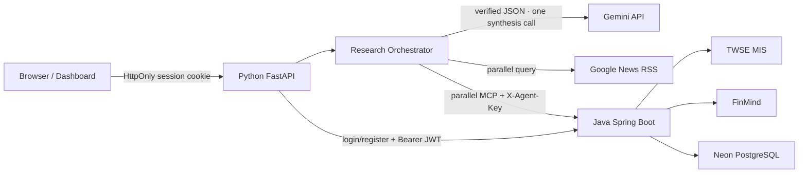
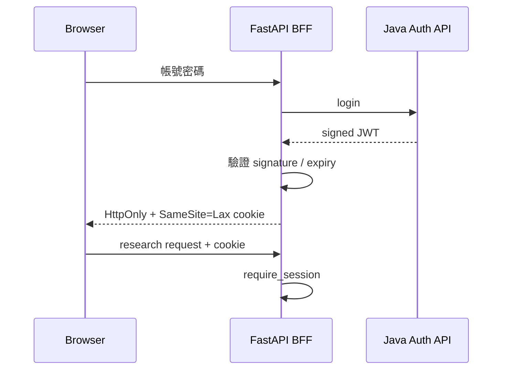

# FinScope TW 面試技術說明

這份文件用來說明 `taiwan-stock-research-agent` 與 `StockTracker` 如何共同組成一個可查證的台股研究 Agent，以及面試時應如何介紹架構、程式碼與工程取捨。

## 30 秒專案介紹

FinScope TW 是一個「先查證、再整理」的台股研究助理。使用者用自然語言提問後，Python FastAPI 依股票代號與查詢意圖規劃即時行情、月營收或近期新聞查詢，並平行取得資料；其中股票資料透過 MCP 呼叫獨立的 Java/Spring Boot StockTracker。所有結果組成結構化 JSON 後，只呼叫 Gemini 一次完成摘要。系統列出工具軌跡與新聞來源，但不預測股價，也不提供買賣建議。

一句話版本：

> 我把原有的 Java 台股資料系統擴充成 MCP Server，再用 Python 建立具備規則式查詢規劃、平行取證、單次模型彙整、會員驗證與錯誤處理的研究 Agent。

## 為什麼值得做成兩個服務

| 服務 | 主要責任 | 為什麼由它負責 |
|---|---|---|
| Java / StockTracker | 股票資料、會員、JWT、PostgreSQL、MCP tools | 延續原有 Java domain service，維持單一資料來源 |
| Python / Research Agent | deterministic planning、平行資料查詢、新聞搜尋、BFF、研究介面 | 把可驗證的流程留在程式碼，降低模型回合數與工具選擇變異 |
| Gemini | 將已查證 JSON 彙整成研究摘要 | 只呼叫一次，不取得 tools、DB 或服務密鑰 |

拆成兩個 repository 不是 MCP 的必要條件，但能清楚呈現服務邊界：Java 是可被不同 AI Client 重複使用的資料工具服務，Python 是目前的一個 Agent Client。未來換模型或新增另一個 Agent，不必改寫股票商業邏輯。

## 系統架構


```mermaid
flowchart LR
    U["Browser / Dashboard"] -->|"HttpOnly session cookie"| P["Python FastAPI"]
    P --> O["Research Orchestrator"]
    O -->|"verified JSON · one synthesis call"| G["Gemini API"]
    O -->|"parallel query"| N["Google News RSS"]
    O -->|"parallel MCP + X-Agent-Key"| J["Java Spring Boot"]
    P -->|"login/register + Bearer JWT"| J
    J --> T["TWSE MIS"]
    J --> F["FinMind"]
    J --> D["Neon PostgreSQL"]
```

### 一次研究請求如何流動

1. 使用者登入後送出自然語言問題。
2. FastAPI 驗證 HttpOnly cookie，將問題交給 `ResearchOrchestrator`。
3. Python 依股票代號與問題關鍵字規劃允許的唯讀查詢。
4. 新聞工具與 Java MCP 行情／營收工具可透過 `asyncio.gather` 平行執行。
5. 工具結果組成預先查證 JSON，並在停用 tools 的情況下交給 Gemini 一次。
6. Gemini 產生繁體中文研究摘要；純行情請求則直接格式化工具結果、完全略過 Gemini。
7. 工具失敗時保留明確的資料限制，不用模型猜一個數字補上。

## Java：原專案增加了什麼

Java 仍然是股票與會員資料的 source of truth。AI 擴充集中在以下區域：

| 程式位置 | 面試時的說法 |
|---|---|
| `com.service.agent.AgentStockService` | 將 TWSE、FinMind 原始回應轉成穩定的 domain DTO，驗證四碼股票代號並統一例外 |
| `com.controller.AgentStockController` | 提供一般 REST 版本的行情與營收端點，方便除錯及非 MCP Client 使用 |
| `com.mcp.StockMcpTools` | 用 Spring AI `@Tool` 暴露 `get_stock_snapshot`、`get_revenue_history` |
| `com.config.McpToolConfig` | 將 Java 方法註冊成 MCP tools |
| `com.config.AgentApiKeyInterceptor` | 以 `X-Agent-Key` 保護 Agent/MCP 端點，並使用 constant-time comparison |
| `com.exception.api` | 將無效代號、查無股票、上游失敗轉成一致且可理解的錯誤 |
| `com.util.HttpUtil` | 對暫時性的上游錯誤加入有限次 retry，不對所有錯誤無限重試 |
| `com.controller.HealthController` | 提供部署平台與 Python warm-up 使用的健康檢查 |

會員功能不是在 Python 重新做一套。Java 繼續負責 bcrypt 密碼雜湊、使用者資料與 JWT 簽發；Python 只扮演 BFF。

近期針對正式環境也強化了：

- `DBUtil` 驗證資料庫環境變數，讓設定錯誤能提早被發現。
- `UserDaoImpl` 使用 try-with-resources 並向上拋出 DB 錯誤，不再把寫入失敗誤報成註冊成功。
- `AuthController` 能區分帳密錯誤與會員資料庫不可用，後者回傳 503。
- `AuthServiceImpl` 改為建構式注入 `UserDao`，讓密碼雜湊、重複帳號與 DB 失敗可被獨立測試。

### Java MCP tool 的價值

MCP tool 回傳的是有結構的 `StockSnapshotToolResult` 與 `RevenueHistoryToolResult`，而不是拼成一段自然語言。這讓模型收到明確欄位，也讓同一個 Java tool 可以被其他 MCP Client 重用。

## Python：Agent 服務如何組成

| 程式位置 | 責任 |
|---|---|
| `app/main.py` | FastAPI lifecycle、依賴組裝、health/warm-up、market ticker cache |
| `app/agent/orchestrator.py` | system policy、規則式查詢規劃、平行取證、單次 Gemini 彙整、fail-closed |
| `app/tools/executor.py` | 執行工具、統一成功/失敗格式並記錄耗時 |
| `app/clients/stocktracker.py` | 可重用的 MCP session、Java readiness、API key、結果解碼與錯誤正規化 |
| `app/clients/news.py` | 搜尋 Google News RSS，解析標題、時間與來源連結 |
| `app/clients/market.py` | 讀取證交所最近交易日成交量排行，排除 ETF 後提供上市個股候選 |
| `app/clients/gemini.py` | 將已查證資料送入 Gemini；主要模型額度不足時立即改用 Flash-Lite，避免 SDK 隱藏的長時間重試 |
| `app/clients/auth.py` | 呼叫 Java 註冊、登入與會員 API |
| `app/auth/session.py` | 驗證 Java HS256 JWT，轉成安全的同源 HttpOnly cookie session |
| `app/api/session.py` | 登入、登出、demo account 與會員資料端點 |
| `app/api/research.py` | 驗證會員後接受研究請求 |
| `app/middleware/rate_limit.py` | 控制作品集公開服務的請求頻率與模型成本 |
| `app/static` | Dashboard、快速提問、圖表、研究軌跡與引用來源 UI |

### Agent orchestration 不代表一定要讓模型選工具

目前版本的核心不是「把問題直接丟給 Gemini」：

- FastAPI 依股票代號與問題意圖規劃允許的唯讀查詢。
- 行情、營收與新聞可平行取得；成交量排行問題先查官方排行，再查候選股行情與新聞。API key 與資料庫密碼都不會交給模型。
- Gemini 只收到已查證 JSON，且呼叫時不提供 tools。
- 完整研究只有一次最終彙整；主要模型若回 429，可能額外呼叫一次備用模型。純行情與純新聞清單略過 Gemini。
- 即時股價必須來自 snapshot tool；近期事件必須有 news source。
- 失敗會保留 tool trace 並明示資料限制，不用模型既有知識補即時數字。

### 設計演進：為什麼取消 function-calling loop

第一版 MVP 曾讓 Gemini 透過 function calling 自行選工具，最多三輪。實際部署後，重複模型回合增加 latency、token 成本與選錯／重複呼叫工具的變異，因此在 commit `5a9de80` 改成 deterministic planner：程式先取證，再讓 Gemini 單次彙整。`MAX_AGENT_STEPS` 目前只為舊部署設定相容保留，不再控制模型工具迴圈。

## 會員與安全邊界


```mermaid
sequenceDiagram
    participant B as Browser
    participant P as FastAPI BFF
    participant J as Java Auth API
    B->>P: 帳號密碼
    P->>J: login
    J-->>P: signed JWT
    P->>P: 驗證 signature / expiry
    P-->>B: HttpOnly + SameSite=Lax cookie
    B->>P: research request + cookie
    P->>P: require_session
```

重要設計點：

- 瀏覽器 JavaScript 讀不到 JWT，降低 token 被前端腳本竊取的風險。
- Java 與 Python 必須使用同一組 `JWT_SECRET`；不同用途的 `AGENT_API_KEY` 保護 MCP 服務。
- Demo 密碼只存在 Lightsail instance environment，API response 與前端程式都不回傳它。
- Demo 第一次使用時，Python 先嘗試登入；只有收到 401 才註冊並重試。已有帳號時不會重複註冊。
- 公開作品集加上 rate limit；MCP tools 是唯讀工具，沒有下單能力。

## Unit test：推薦，而且要測對地方

推薦做單元測試，但不要測「Gemini 每次是否寫出完全相同的句子」。LLM 輸出具有非決定性，應把測試分成三層：

| 層次 | 測什麼 | 本專案做法 |
|---|---|---|
| Unit / component tests | 可決定的程式邏輯與錯誤分支 | Java Maven tests、Python pytest |
| Behavioral evals | Agent 是否選到必要工具、是否附限制與引用 | `evals/cases.json`、`evals/run_evals.py` |
| Live smoke test | 真實部署、MCP handshake、TWSE/FinMind 是否可連 | `scripts/check_mcp.py` 與網站 demo |

目前測試結果：

- Java：23 tests，0 failures，0 errors。
- Python：62 tests，全部通過。

這次新增的高價值案例：

- Java 註冊前會雜湊密碼，DAO 收到的不是明文。
- Java DB 寫入失敗必須向上拋出，不能顯示假成功。
- Java 重複 username 不得執行 insert。
- Python demo 首次登入遇到 401，會註冊後重試。
- Python demo 帳號已存在時，不會再次註冊。
- JWT cookie 不會把 token 或 demo 密碼放進 response body。

執行方式：

```bash
# Java
mvn test

# Python
.venv/bin/python -m pytest -q
```

## 真實問題與修正：面試很好用的案例

### 1. Render cold start 導致 MCP timeout

**問題：** Python 已醒來，但免費 Render 上的 Java 仍在休眠；第一個 MCP request 在 Java ready 前逾時。

**處理：** 加入 Java health readiness、Python 背景 warm-up、瀏覽器進站預熱、延長有上限的等待時間，並重用已建立的 MCP session。

**學到：** 問題不是「LLM 不穩」，而是跨服務 lifecycle 與免費部署資源限制。觀測工具軌跡後才能找到真正故障點。

### 2. 註冊顯示成功，但 Neon 沒有資料

**問題：** Render 的 DB URL 格式曾設定錯誤，修正後又遇到 `created_at NOT NULL`；舊 DAO 捕捉 SQLException 後只印 log，Service 因此誤以為成功。

**處理：** 修正環境設定及 insert SQL，DAO 改為 try-with-resources、驗證 affected rows 並傳遞錯誤；Controller 將基礎設施故障回成 503。

**學到：** 不應在 data access layer 吞掉錯誤。API 的狀態碼也是系統契約，401 與 503 對除錯和使用者體驗有完全不同的意義。

#### 實際故障鏈

1. Render 的環境變數欄位只應填 JDBC URL，曾誤填成 `DB_URL=jdbc:postgresql://...`。`DriverManager` 因此收到不是 JDBC URL 的字串。
2. 修正連線字串後，Neon 的 `users.created_at` 是 `NOT NULL`，但原本的 INSERT 沒有提供此欄位，PostgreSQL 拒絕寫入。
3. 原本 DAO 使用 `catch (SQLException e) { e.printStackTrace(); }`，印完錯誤後正常 return。
4. `AuthServiceImpl.register()` 不知道 insert 已失敗，Controller 便回傳 `201 註冊成功`；實際上資料庫沒有會員，接著登入自然得到 401。

#### 修改一：不要吞掉 SQLException

```java
// 修改前：呼叫者收不到失敗訊號
try {
    ps.executeUpdate();
} catch (SQLException e) {
    e.printStackTrace();
}

// 修改後：保留 cause，讓 Service / Controller 能正確處理
try (Connection conn = DBUtil.getConnection();
     PreparedStatement ps = conn.prepareStatement(sql)) {
    int insertedRows = ps.executeUpdate();
    if (insertedRows != 1) {
        throw new IllegalStateException("建立使用者失敗");
    }
} catch (SQLException e) {
    throw new IllegalStateException("無法建立使用者", e);
}
```

try-with-resources 會在成功與例外兩條路徑都關閉 `Connection`、`PreparedStatement`、`ResultSet`，避免連線資源逐漸耗盡。查詢方法也改成 DB 失敗時丟出例外；只有「查詢成功但沒有這個會員」才回傳 `null`。

#### 修改二：INSERT 符合 Neon schema

```java
String sql = "insert into users(username,password,email,created_at) "
        + "values(?,?,?,CURRENT_TIMESTAMP)";
```

這次採用 `CURRENT_TIMESTAMP` 讓 PostgreSQL 產生時間。長期更理想的做法是替 schema 設定 `created_at DEFAULT CURRENT_TIMESTAMP`，再用 migration tool 管理 Java 與正式資料庫的 schema 版本。

#### 修改三：在 HTTP 層區分 401 與 503

```java
try {
    String token = authService.login(identifier, password);
    return ResponseEntity.ok(new LoginResponse(token));
} catch (IllegalStateException ex) {
    return ResponseEntity.status(HttpStatus.SERVICE_UNAVAILABLE)
            .body(Map.of("detail", "會員資料服務暫時無法使用"));
} catch (RuntimeException ex) {
    return ResponseEntity.status(HttpStatus.UNAUTHORIZED)
            .body(Map.of("detail", "帳號或密碼錯誤"));
}
```

`IllegalStateException` 本身也是 `RuntimeException`，所以必須先 catch；順序相反會永遠進入 401 分支。401 表示使用者憑證不正確，503 表示伺服器的會員資料依賴暫時不可用。這也讓 Python BFF 知道只有真正的 401 才應進入 Demo 帳號首次註冊流程。

#### 修改四：環境變數 fail fast

```java
String normalized = value.trim();
if (normalized.startsWith(key + "=")) {
    throw new IllegalArgumentException(
            "環境變數 " + key + " 的值不應包含 " + key + "= 前綴");
}
```

與其等到第一次 SQL request 才出現模糊的 JDBC 錯誤，啟動時就指出 Render 設定值格式錯誤，能大幅縮短部署除錯時間。

### 3. TWSE 偶發失敗

**問題：** 即使服務已啟動，上游行情 API 仍可能短暫失敗。

**處理：** Java HTTP client 對可恢復的暫時性錯誤做有限 retry，並將最後失敗轉成結構化 tool error；Agent 明示資料限制。

**學到：** retry 必須有範圍與上限，且不能把永久性錯誤或無效股票代號當成暫時性錯誤重試。

## 面試常見問題與建議回答

### 為什麼不用 Java 直接呼叫 Gemini？

Java 保留已成熟的股票、會員與資料庫能力；Python 專注 Agent orchestration。這不是因為 Java 做不到 AI，而是讓模型或 orchestration 的變更不影響既有 domain service，也能展示跨語言服務整合。

### MCP 和一般 REST API 差在哪裡？

REST 端點是為固定的應用流程設計；MCP 讓 AI Client 用標準方式發現 tool 名稱、輸入 schema 與結構化結果。底層仍是 HTTP，但 Agent 不需要為每個 Java 方法寫一套專屬協定。專案同時保留 REST，方便一般 Client 與診斷。

### 怎麼降低 hallucination？

我沒有宣稱完全消除 hallucination，而是建立約束：需要即時數字時強制使用工具、工具結果用 JSON、近期事件要有來源、限制迴圈、工具失敗就明示缺資料，並在 UI 顯示查詢軌跡。

### 為什麼不用本地模型？

模型透過環境設定可替換，目前選擇 hosted Gemini 負責最後的語言彙整，避免在 Lightsail 上承擔模型權重、GPU／記憶體與啟動成本。工具規劃已由 FastAPI 掌握，因此不依賴本地小模型是否能穩定 function calling。

### 怎麼控制成本？

完整研究固定最多一次 Gemini call，純行情完全略過模型；另外限制新聞筆數與查詢期間、公開 API rate limit、market ticker cache，並把模型部署交給 API provider。這些限制同時控制成本、latency 與失控風險。

### 如果 Java 或外部 API 壞掉呢？

Tool executor 會保留 error trace；可恢復的連線問題有限重試，仍失敗時回覆資料限制。Agent 不會用新聞中的數字冒充 MCP 即時行情。

### 為什麼要同時有 unit tests 和 evals？

Unit test 適合 JWT、錯誤轉換、DAO interaction、tool dispatch 等決定性邏輯；eval 適合檢查「遇到某類問題是否選對工具、是否遵守回答政策」。兩者處理不同風險，不能互相取代。

## 三分鐘 Demo 腳本

1. **20 秒：定位** —「這不是選股或交易機器人，而是每個即時數字都有工具軌跡的台股研究助理。」
2. **30 秒：會員** — 點一鍵 Demo 登入，說明 Java 管理帳號/JWT，Python 以 HttpOnly cookie 保護瀏覽器 session。
3. **50 秒：行情** — 問「台積電今天股價和漲跌幅」，指出 FastAPI 直接規劃 Java MCP snapshot tool，純行情不呼叫 Gemini，畫面顯示耗時與結果。
4. **50 秒：複合問題** — 問「聯發科近期 AI 晶片消息與營收趨勢」，展示新聞、營收工具與引用來源。
5. **30 秒：架構** — 說明 Python Agent 與 Java domain service 的分工，以及 MCP/X-Agent-Key 邊界。
6. **30 秒：可靠性** — 展示測試結果與 tool failure 的資料限制，強調不編造即時數據。

## 不要過度宣稱

- 不說「能預測股票漲跌」或「可以推薦買賣」。
- 不說「完全不會 hallucinate」；應說有 grounding、policy 與 failure handling 降低風險。
- 不把 Google News RSS 當成完整的專業市場資料庫。
- 不宣稱目前具備 production-grade 高可用；目前是單台 Lightsail，沒有多區容錯或自動水平擴充。
- 不因為用了 MCP 就說它是多 Agent 系統；目前是一個 Agent orchestration service 加兩類外部工具。

## 下一步可擴充

1. 增加固定測試題庫與自動化 LLM-as-judge / rule-based eval report。
2. 將 tool trace、latency、error rate 接到可觀測性平台。
3. 為同一問題加入來源時間與資料新鮮度檢查。
4. 加入研究紀錄保存與會員自選股情境，但維持 tools 唯讀。
5. 若流量提高，再把服務搬到不休眠的主機並設定正式的 secret manager、監控與告警。
